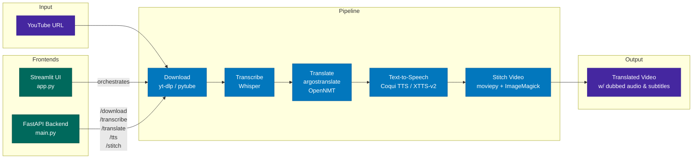

# AI Project Fall 2023
Members:
  - Rafik Saad
  - Banani Ghosh

## Architecture



## Running

```bash
uv sync
streamlit run app.py
```

FastAPI backend:
```bash
uvicorn api.src.main:app --reload
```

Docker Compose (includes Whisper + XTTS GPU services):
```bash
docker compose up
```

## Hugging Face Space

[pantelism/foreign-whispers](https://huggingface.co/spaces/pantelism/foreign-whispers) — live Streamlit app on HF Spaces.

## Pitch Video

[Pete Hegseth: The 60 Minutes Interview](https://www.youtube.com/watch?v=7hPDiwJOHl4) — sample 60 Minutes episode used to demonstrate the Foreign Whispers dubbing pipeline.

## Milestones

1. Download videos + captions from YouTube (pytube / yt-dlp)
2. Transcribe with Whisper
3. Translate with argostranslate (OpenNMT, offline)
4. Text-to-speech with Coqui TTS / XTTS-v2
5. Streamlit UI + pitch video
6. FastAPI backend (`api/src/`) with endpoints for each pipeline stage
